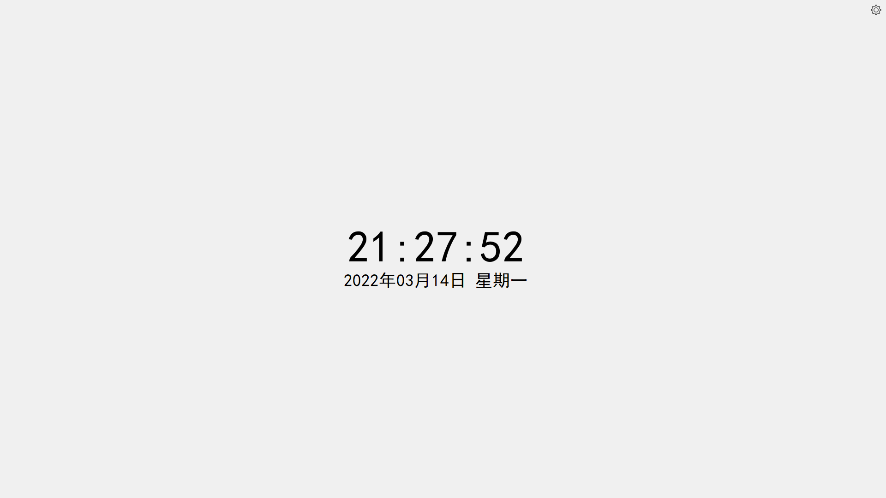
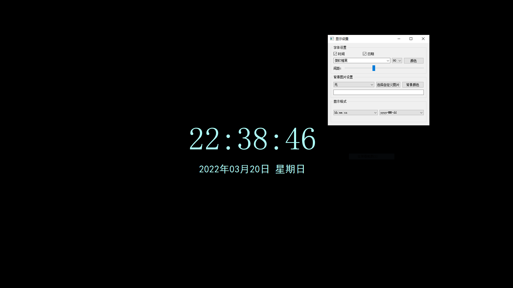

# Qt实现桌面时钟:timer_clock:

[toc]

## 1、测试环境

* windows10
* ubuntu20.04
* 树莓派：2021-05-07-raspios-buster-armhf

## 2、打包程序

* Win64版本
* Win32版本
* 2021-05-07-raspios-buster-armhf版本

## 3、实现功能

1. 显示时间:timer_clock:
2. 显示日期:date:
3. 全屏显示
4. 可分别设置时间、日期字体、大小、颜色
5. 可设置背景颜色、内置背景图片、自定义背景图片
6. 可设置时间、日期文字行距
7. 可设置时间、日期显示样式

## 4、实现效果

